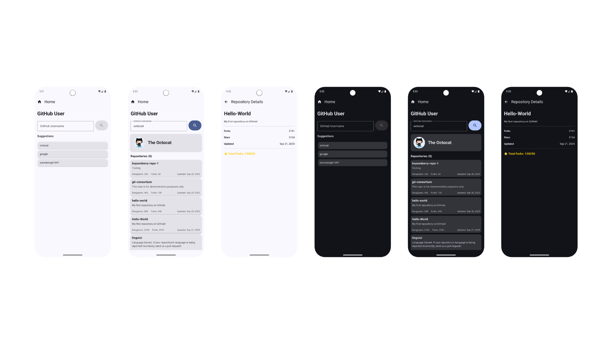

# GitScope
A modern Android application for GitHub user profile exploration and repository analysis.

## Features

### Core Functionality
- **GitHub User Search** - Search and explore GitHub user profiles by username
- **User Profile Display** - View comprehensive user information including avatars and basic details
- **Repository Analytics** - Access stars, forks, and last updated information for each repository
- **Fork Analytics** - Calculate total forks across all user repositories with recognition badges for users with 5000+ total forks
- **Recent Searches** - Track and display recent searches for quick navigation

## Screenshots


## App Demo


## Architecture

This application follows **Clean Architecture** principles with **Unidirectional Data Flow (UDF)** pattern implementation:

### Layer Structure
```
Presentation Layer
├── UI (Jetpack Compose)
├── ViewModels
└── UI States

Domain Layer  
├── Use Cases
└── Domain Models

Data Layer
├── Repository Implementations
├── Data Models
└── Remote Data Sources
```

### Unidirectional Data Flow Implementation
The application implements UDF pattern ensuring predictable state management:

```
UI Events → ViewModel → Use Cases → Repository → API
    ↑                                              ↓
UI State ← StateFlow ← Domain Models ← Data Models
```

**Data Flow Process:**
1. **UI Events** - User interactions trigger events (search, navigation, selection)
2. **ViewModel** - Processes events and manages state updates
3. **Use Cases** - Encapsulate business logic and coordinate data operations
4. **Repository** - Abstracts data sources and provides unified data access
5. **API Layer** - Handles GitHub API communication
6. **State Updates** - Reactive UI updates via StateFlow emissions

### Architecture Benefits
- **Testability** - Isolated layers enable comprehensive unit testing
- **Maintainability** - Clear separation of concerns simplifies code understanding
- **Scalability** - Modular structure supports feature expansion without breaking changes
- **Flexibility** - Abstracted dependencies allow for easy component replacement
- **Predictable State** - UDF pattern ensures consistent state management
- **Reactive UI** - StateFlow provides efficient UI updates

## Technical Stack

### Core Technologies
- **Kotlin** - Primary development language
- **Jetpack Compose** - Modern declarative UI framework
- **Coroutines & Flow** - Asynchronous programming and reactive streams
- **Hilt/Dagger** - Dependency injection framework
- **Retrofit** - HTTP client for REST API communication
- **Material Design 3** - UI design system implementation

### Architecture Components
- **ViewModel** - UI-related data management
- **StateFlow** - State management and reactive programming
- **Use Cases** - Business logic encapsulation
- **Repository Pattern** - Data source abstraction layer
- **Clean Architecture** - Separation of concerns principle

## Testing Strategy

The application includes comprehensive testing coverage across multiple layers:

### Test Approach
- **Unit Tests**
   - Use cases: `GetUserUseCase`, `GetUserRepositoriesUseCase`, `CalculateTotalForksUseCase`, `GetUserWithRepositoriesUseCase`,
   - Repository: `GitHubScopeRepository`
   - Business logic validation
- **Integration Tests**
   - ViewModel implementations: `UserViewModel`
   - Concurrent operations
   - Proper state management
- **UI Tests** (Presentation Layer)
   - Compose UI behavior
   - Render Previews
   - Screen: `GitHubUserScreen`, `RepositoryDetailScreen`

### What Is Covered
- **Covered:**
  - Input validation 
    - Empty userId
  - Success scenarios 
    - Valid user response with proper data mapping
  - Error Handling 
    - Invalid user id
    - Network error
    - Invalid State
  - Edge Cases
    - Null user id
    - Empty repo or Single repo return correct total
    - Concurrent Searches
  - Data transformation 
    - Trimming whitespace
  - UI rendering 
    - Star badge visibility

### Local Test Execution
To enable automatic test execution on every build, uncomment the following configuration in `build.gradle` (app level):

```gradle
// Uncomment to run tests automatically on build
// android {
//     tasks.whenTaskAdded {
//        if (name == "assembleDebug"){
//            dependsOn("testDebugUnitTest")
//            dependsOn("connectedDebugAndroidTest")
//        }
//    }
// }

```

## CI/CD Pipeline

### GitHub Actions Integration
Automated pipeline running on JDK 17 (please refer to `.github/workflows/android.yml` )

**Pipeline Configuration:**
- Unit tests
- Code quality checks (lint)
- APK generation

### Available Artifacts
After each build, check the Actions tab on GitHub for downloadable artifacts:
- APK files (debug/release builds)
- Test reports (unit tests only)
- **Note** - Instrumented tests run locally only (no emulator in GitHub Actions).

## Future Enhancements

### Security Implementation
- **Custom Authentication Annotations**
    - Implement declarative security with custom annotations
    - Create @Authenticated annotation class for endpoint security marking
    - Develop OkHttp interceptor to automatically inject Bearer tokens based on annotation presence
    - Support multiple authentication strategies (OAuth, Personal Access Tokens, GitHub Apps)

```kotlin
    @Authenticated
    @GET("user/repos")
    suspend fun getAuthenticatedUserRepos(): List<Repository>
```

### Technical Improvements
- **Navigation Architecture Enhancement**
    - Implement proper navigation routing for repository details
    - Add deep linking support for direct repository access
    - Migrate to proper Navigation Component implementation with type-safe arguments
    - Separate ViewModels and UI states for repository details following UDF principles

```kotlin
     // Future implementation structure
    @Composable
    fun RepositoryDetailScreen(
        repositoryId: String,
        viewModel: RepositoryDetailViewModel = hiltViewModel()
    ) {
        val uiState by viewModel.uiState.collectAsState()
        // Proper state management with dedicated ViewModel
    }
```

- **Reactive Programming Enhancement**
    - Migrate from suspend functions to Flow-based reactive architecture
    - Replace simple suspend function calls with proper Flow streams for reactive programming

```kotlin
      // Current: Overkill Flow wrapper
        override fun getUserFlow(userId: String): Flow<Result<User>> =
          flow {
            emit(Result.Loading())
            emit(getUser(userId))
          }.flowOn(ioDispatcher)
        
        override fun getUserRepositoriesFlow(userId: String): Flow<Result<List<Repository>>> = flow {
          emit(Result.Loading())
          emit(getUserRepositories(userId))
        }.flowOn(ioDispatcher)
```

- **Security & Code Protection**
    - Implement ProGuard rules for data obfuscation
    - Add comprehensive ProGuard/R8 rules to protect sensitive business logic
    - Obfuscate API endpoints, repository implementations, and domain models

``` markdown
      # Protect domain models and API interfaces
        -keep class com.example.gitscope.domain.model.** { *; }
        -keep class com.example.gitscope.data.api.** { *; }
        
        # Obfuscate repository implementations
        -keepclassmembers class com.example.gitscope.data.repository.** {
            public <methods>;
        }
```

## Getting Started

### Prerequisites
- Android Studio Hedgehog (2023.1.1) or newer
- Java Development Kit 17
- Android SDK API Level 34
- Git version control system

### Installation and Setup
1. **Repository Cloning**
   ```bash
   git clone https://github.com/anmolsingh1597/GitScope.git
   cd GitScope
   ```

2. **Project Opening**
   ```bash
   # Launch Android Studio with project
   studio .
   ```

3. **Project Synchronization**
    - Allow Gradle dependency synchronization to complete
    - Verify JDK 17 configuration in project settings

4. **Application Execution**
   ```bash
   # Command line build
   ./gradlew assembleDebug
   
   # Alternative: Use Android Studio run configuration
   ```

## Project Structure

```
app/
├── src/
│   ├── main/
│   │   ├── java/com/example/gitscope/
│   │   │   ├── data/           
│   │   │   ├── di/         
│   │   │   ├── domain/   
│   │   │   └── presentation/           
│   │   └── res/               
│   ├── test/                  
│   └── androidTest/           
├── build.gradle              
```

